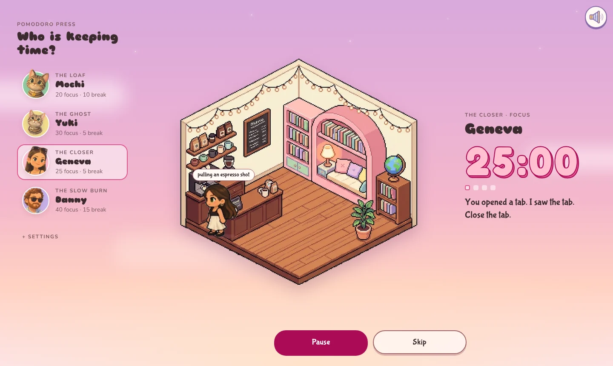
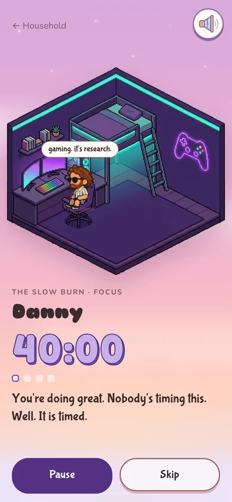
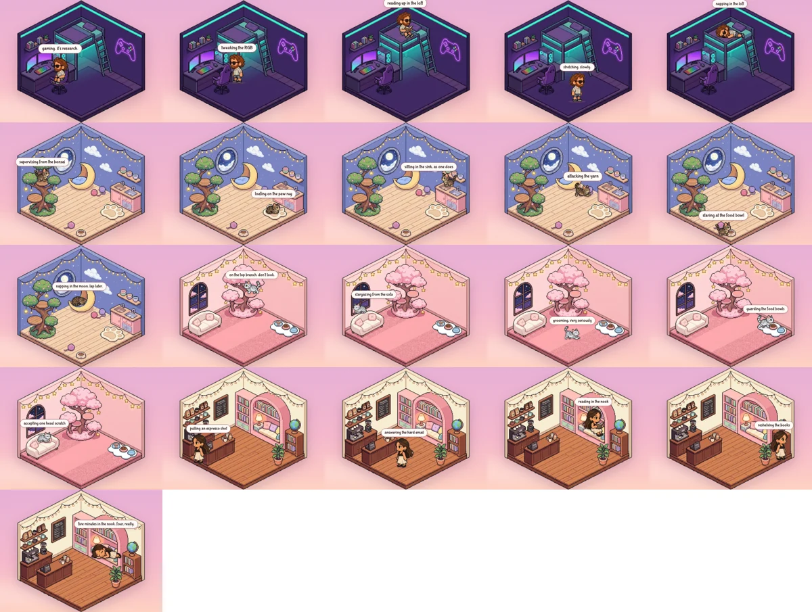

# Pomodoro Press


**A cozy pomodoro timer kept by my household.** Pick who keeps time: Mochi,
Yuki, Geneva or Danny. Each one has their own session lengths, colors, voice
and pixel-art room, and you watch them go about their day while you focus.

**Live app:** https://pomodoro-press.netlify.app — installable on phone and
desktop, works offline.



<p align="center">
  
</p>

## The idea

Most focus timers are a number on a screen. I wanted one that felt like
company: a timer kept by the people (and cats) I live with, in their own
voices, with the warmth of a cozy life-sim game. Mochi will tell you she's
on your keyboard. Geneva will tell you to close the tab. Danny will remind you
it isn't a race.

## What it does

- **Four timekeepers, four personalities.** Each has their own focus/break
  lengths (from Mochi's 20/10 to Danny's 40/15), color palette and lines that
  rotate every few minutes while you work.
- **Living rooms.** Every character has a pixel-art room. During focus they
  walk between spots — Danny games and reads up in his loft, Geneva pulls
  espresso and reads in her nook, the cats patrol their trees — switching to
  sitting, reading, sleeping or stretching poses as they go. Tap one and it
  wiggles.
- **Sound that keeps you on track.** An original lofi loop (mutable), a chime
  at 5 minutes left, ticks for the final 10 seconds and a music-box ring at
  zero.
- **Built for real use.** Accurate in background tabs, survives refreshes,
  installs like an app on iPhone, Android, Mac and Windows, and works offline.



## How I built it

I built this as an AI-directed product: I owned the concept, the experience
and the art direction, and used AI tools to build and illustrate it,
iterating through reviews of each version.

- **Product & design direction (me):** the concept, characters and their
  voices, the cozy-game look, the reference boards for each room, and
  feedback on every iteration (layout, whimsy, sizing, controls).
- **Engineering:** Claude Code (Anthropic's coding agent) wrote the React +
  TypeScript app, tested it in a headless browser at phone and desktop sizes,
  and handled the asset pipeline — cutting backgrounds off the art, slicing
  sprite sheets, and compressing images.
- **Art:** rooms, walk cycles and poses generated with Nano Banana (Google)
  from prompts written for a consistent pixel-art style.

### Decisions along the way

- **Code-drawn rooms → generated pixel art.** The first rooms were drawn in
  code. They worked, but couldn't match the reference mood, so the code was
  restructured to place characters on painted room images instead.
- **Floating heads → walking sprites with poses.** Characters started as
  portrait cut-outs; walk cycles and pose sheets turned them into residents.
- **Original music instead of a downloaded track.** The lofi loop is
  generated in code, so there's no licensing question.
- **Web app instead of the app stores.** For personal use, an installable
  web app gives the same experience for free; the stores would add cost and
  review overhead for one extra capability (notifications on a locked phone).
- **Sounds scheduled on the audio clock.** Browsers slow down timers in
  background tabs, so cues are scheduled ahead on the audio hardware clock to
  land on the exact second.

## Tech

React, TypeScript, Vite, Web Audio API, PWA (service worker + manifest),
hosted on Netlify with automatic deploys from GitHub.

---

## Run it

```bash
npm install
npm run dev       # local dev server (open the URL it prints)
npm run build     # type-check + production build into dist/
npm run preview   # serve the production build
```

To try it on your phone, run `npm run dev -- --host` and open the "Network"
URL on a phone on the same Wi-Fi.

## Install it like an app

Pomodoro Press is a Progressive Web App: once it's hosted on an `https://`
address, it can be installed and works offline (the app, art and music are
cached on first visit).

- **iPhone/iPad (Safari):** Share → *Add to Home Screen*
- **Android (Chrome):** menu → *Install app*
- **Mac/Windows (Chrome or Edge):** install icon in the address bar.
  Safari on Mac: File → *Add to Dock*

### Hosting

Hosted on Netlify. Every push to `main` rebuilds and publishes the app; build
settings and cache headers live in `netlify.toml`. Installed copies update
themselves on next launch.

App icons live in `public/` (`icon-192.png`, `icon-512.png`,
`icon-maskable-512.png`, `apple-touch-icon.png`, `favicon-64.png`); the
install settings are in `vite.config.ts`.

## Where to edit things

| What | Where |
|---|---|
| Characters: names, roles, minutes, colors, all copy | `src/characters.ts` |
| Each character's spots in their house, activities and poses | `house` in `src/characters.ts` |
| How often the running nudge changes (default 5 min) | `NUDGE_EVERY_MIN` in `src/characters.ts` |
| How often they move to a new spot (default 2 min) | `ACTIVITY_EVERY_MIN` in `src/characters.ts` |
| House art | `public/art/house-<id>.png` — transparent background, 4:3 (1200 × 900) |
| Walk cycle | `public/art/sprites/<id>.png` — 4 frames side by side, facing right |
| Poses | `public/art/sprites/<id>-poses.png` — 4 frames side by side, facing right, same scale as the walk strip |
| Roster portraits | `public/art/<id>.png` (transparent cut-outs). Missing file → initials in the character's ink |
| Colors, fonts, sky, layout | `src/styles.css` (font choices are the `--display`, `--hand`, `--timer`, `--body` variables) |

To add a character, add an entry to `CHARACTERS` and drop their art files in.

### Houses

Each character lives in their own room. While focus runs, they walk between
the `stations` in their `house` config (one every `ACTIVITY_EVERY_MIN`
minutes) with a speech bubble saying what they're up to. Once they arrive they
switch to that spot's `pose`:

- People: `0` stand, `1` sit, `2` read, `3` sleep
- Cats: `0` stand, `1` loaf, `2` sleep, `3` stretch

On break and at the end of a set they go to their `rest` spot. Tap them (in
the house or the roster) to make them wiggle.

Spots use 400 × 300 units laid over the 4:3 house art: `x` runs left → right,
`y` top → bottom, and `y` is where their feet (or bottom) sit. `face` turns
them left/right once they arrive.

If you replace a house image, re-check the spots — they're placed by eye on
the current art.

### Sound

- **Lofi music** loops in the background; the speaker button (top right)
  mutes it. It's `public/audio/lofi.mp3`, which was rendered from the
  generator in `src/sound.ts` (`renderLofi`) — so it's ours, no licence needed.
  Replace the file with any track you have the rights to; if the file is
  missing, the app generates the loop on the fly.
- **Timer sounds** (Settings → Timer sounds): a soft chime at 5 minutes left,
  ticks for the last 10 seconds, and a music-box ring at zero. These are
  scheduled ahead on the audio clock, so they stay on time in a background tab.
- Browsers only allow sound after the first tap or click on the page.

### Opening screen

A sleepy cloud says "loading household…" while the portraits load (at least
1.8s, at most 4s), then fades into the roster. See `src/components/Loader.tsx`.

### Rotating nudges

While focus is running, the line under the timer cycles through that
character's `nudges` list, moving to the next one every `NUDGE_EVERY_MIN`
minutes. Add or remove lines freely. Turn the line off in Settings.

## How it works

- **Timer accuracy:** the clock stores an end timestamp and computes time left
  from it, so it stays right when the tab is in the background. If phases
  finished while the tab was asleep, they're caught up on return.
- **Flow:** focus → break (starts automatically) → next focus (waits for Start)
  … last focus → Set complete. Skip jumps to the next phase.
- **Saved in localStorage:** settings (sessions per set, nudge on/off, default
  character) and the current session (character, phase, end time, session
  count, paused time left), so a refresh resumes where you were.

## Ideas for later

- **Notifications at phase end** — hook in `handlePhaseEnd` in `src/App.tsx`
  (it receives `{ characterId, from, to }`).
- **Daily log + streaks** — each character already has a `streak` line in the config.
- **Sync across phone and desktop** — timer state is a plain object in `src/timer.ts`,
  so it can be sent to a server as-is.
